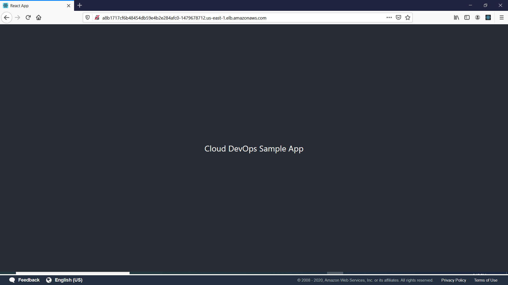

# Cloud DevOps Nanodegree Capstone Project

> This project demonstrates a CI/CD pipeline for a micro services application with rolling deployment. In addition, it also demonstrates Continuous Integration steps that include typographical checking like linting and unit tests.

The tasks involved included:
* Working in AWS
* Using Jenkins to implement Continuous Integration and Continuous Deployment
* Building pipelines
* Working with CloudFormation to deploy clusters
* Building Kubernetes clusters
* Building Docker containers in pipelines


## Getting Setup

### Setting up the local Environment

* Generate the app build

```bash
$ cd sample-app && yarn build
```

* Dockerize the app

```bash
$ ./run_docker.sh
```

* Deploy with Kubernetes

```bash
$ ./run_kubernetes.sh
```


### Setting up an EKS Cluster

* Create a VPC

```bash
$ aws cloudformation create-stack --stack-name cloud-devops-app-vpc-network --template-body file://./infra/vpc/network.yml --region=us-east-1
```

* Create a Cluster Role

```bash
$ aws cloudformation create-stack --stack-name cloud-devops-app-eks-cluster-role --template-body file://./infra/vpc/cluster.yml --region=us-east-1 --capabilities CAPABILITY_IAM
```

* Create an EKS Cluster:

```bash
$ aws cloudformation create-stack --stack-name cloud-devops-app-eks-culster --template-body file://./infra/eks/cluster.yml --region=us-east-1
```

### Launch a managed node group

* Create Amazon EKS worker node role

```bash
$ aws cloudformation create-stack --stack-name cloud-devops-app-eks-nodegroup-role --template-body file://./infra/vpc/nodegroup.yml --region=us-east-1 --capabilities CAPABILITY_IAM
```

* Create Amazon EKS Nodegroup

```bash
$ aws cloudformation create-stack --stack-name cloud-devops-app-eks-nodegroup --template-body file://./infra/eks/nodegroup.yml --region=us-east-1
```


### Deploy Kubernetes

* Update and rollout

```bash
$ ./run_eks_kubernetes
```



### Setting up an CI/CD

* Create Amazon EKS worker node role


### Setting up an CI/CD - Jenkins Server

* Create an EC2 instance
* Install Jenkins   
 - Install BlueOcean and AWS plugins
 - Setup Github repo webhook
* Install node, AWS cli and kubectl

### Running CI/CD - Jenkins Pipeline

#### A) React Step


#### B) Linting Step
##### Linting Step - Fail

##### Linting Step - Pass


#### C) Test
##### Test Step - Fail
   
##### Test Step - Pass
   

#### D) Docker


#### E) Kubernetes


## Built With

* [Jenkins](https://www.jenkins.io/) - The CI/CD used
* [Docker](https://www.docker.com/) - The Containerization system used
* [Kubernetes](https://kubernetes.io/) - Automating deployment system used

## Authors

* **[Pemberai Sweto](https://github.com/thepembeweb)** - *Initial work* - [Cloud DevOps Nanodegree Capstone Project](https://github.com/thepembeweb/cloud-devops-app)

## License

[](http://badges.mit-license.org)

- This project is licensed under the MIT License - see the [LICENSE.md](LICENSE.md) file for details
- Copyright 2020 © [Pemberai Sweto](https://github.com/thepembeweb).


